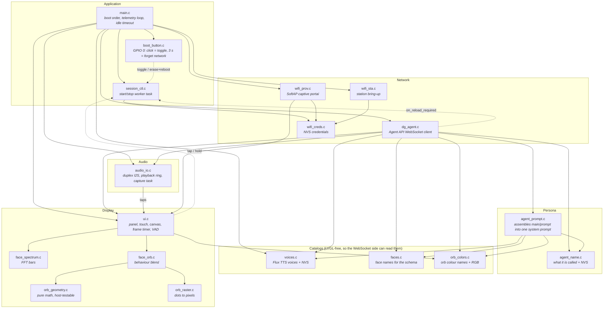
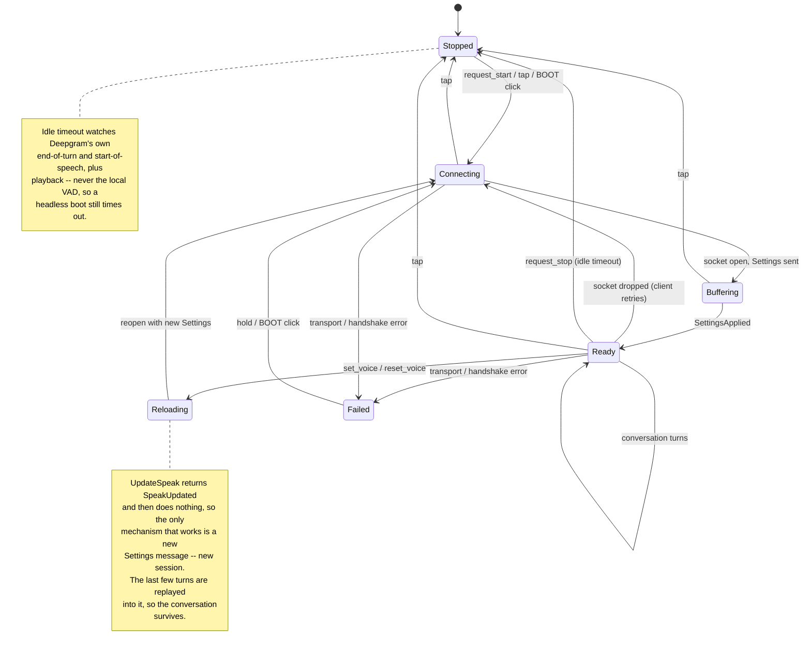
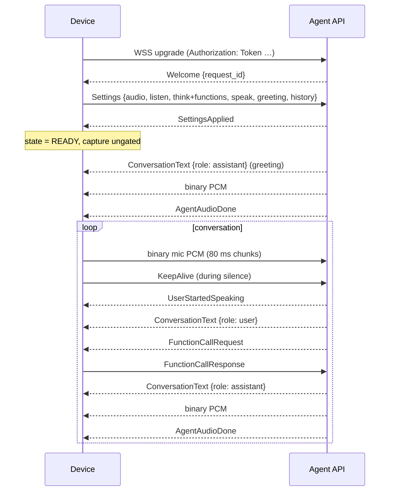
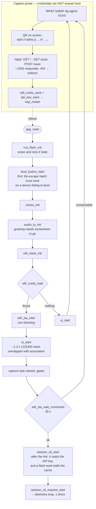
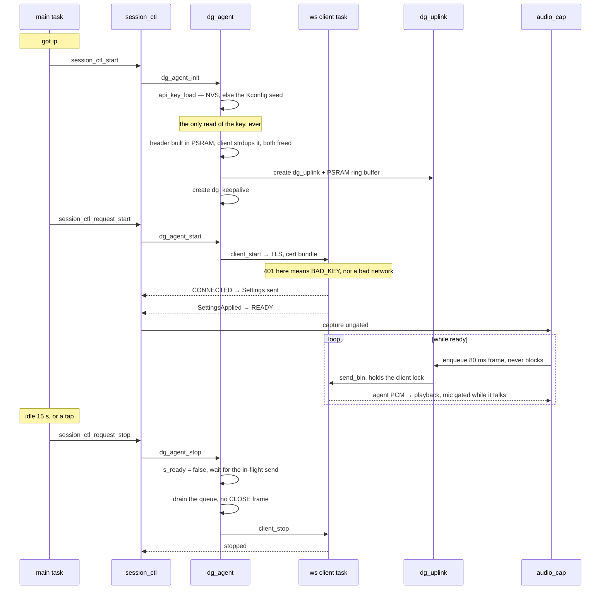
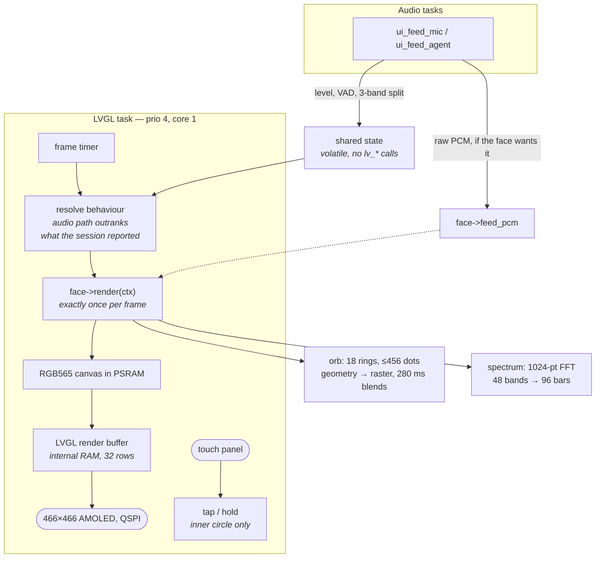
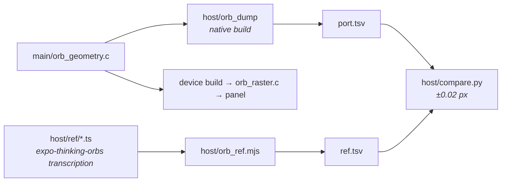

# Architecture

A map of `deepgram_agent`: what the modules are, which task each one runs on,
and how audio gets from the ES7210 microphone to Deepgram and back to the ES8311
speaker. The README explains *why* each piece is the way it is; this document is
the shape of it.

Hardware is a Waveshare ESP32-S3-Touch-AMOLED-1.75C: 466x466 round AMOLED over
QSPI, ES7210 mic and ES8311 speaker on one duplex I2S peripheral, capacitive
touch, and a BOOT button on GPIO 0.

## Modules

Every arrow is a call, pointing from caller to callee. The one rule the whole
layout defends: **nothing outside `ui.c` and the faces may call `lv_*`** — which
is why the catalogs (`voices`, `faces`, `orb_colors`) are separate from the code
that draws. A colour stays a plain `0xRRGGBB` until `orb_raster.c` for the same
reason.

`components/tcp_transport/` overrides ESP-IDF's component of the same name to
patch one line of `transport_ws.c`: `agent.deepgram.com` 404s on a
`Host: host:443` header. Only that file is copied; everything else is referenced
straight out of `$IDF_PATH`, so the override stays a single-file diff.

## The audio path

One duplex I2S peripheral means one sample rate for both directions — 16 kHz
mono, `linear16`, which is what `DG_AUDIO_SAMPLE_RATE` pins. `audio_io.c` owns
both codecs for that reason: opening one reconfigures the other.

```mermaid
flowchart LR
    mic(["ES7210 mic"]) -->|"I2S, 2ch"| cap["capture task<br/>prio 7, core 1<br/><i>1280 frames = 80 ms</i>"]
    cap -->|"L+R averaged to mono"| gate{"capture<br/>enabled?"}
    gate -->|yes| sink["mic_to_agent()"]
    gate -->|no| drop1(["dropped"])
    sink --> ws["dg_agent_send_audio()<br/><i>no-op until READY</i>"]
    ws ==>|"binary frames"| dg{{"Deepgram Agent API<br/>wss://agent.deepgram.com<br/>/v1/agent/converse"}}

    dg ==>|"binary TTS"| oncb["on_audio()<br/><i>WebSocket task</i>"]
    oncb --> ring["playback ring<br/>384 kB PSRAM = 12.3 s mono"]
    ring --> play["playback task<br/>prio 6, core 1<br/><i>mono duplicated to L+R</i>"]
    play -->|"I2S, blocking write"| spk(["ES8311 speaker"])

    gate -.->|"capture tap"| uifeed["ui_feed_mic()"]
    play -.->|"playback tap"| uifeed2["ui_feed_agent()"]
    uifeed & uifeed2 --> uibox["ui.c<br/><i>level, VAD, band split</i>"]

    dg -.->|"UserStartedSpeaking"| flush["audio_io_flush()<br/><i>barge-in</i>"]
    flush -.-> ring
```

Three things in that picture are load-bearing:

- **The ring absorbs pacing.** Deepgram delivers a whole turn faster than it
  plays. The visualizer is tapped at the *drain* end, not at `audio_io_play()`,
  so it stays in step with the speaker instead of racing ahead and finishing
  while the device is still talking.
- **Capture is gated, not stopped.** The ES7210 is clocked by the shared duplex
  I2S regardless, so the task keeps reading; what the gate cuts is everything
  downstream. Stopping the read would only overflow the RX ring and produce a
  stale burst on resume. This is the stand-in for echo cancellation — see the
  README's "Echo: why capture is gated".
- **Barge-in drops queued audio.** When Deepgram says the user started speaking,
  anything still in the ring is a reply they have already talked over.

## Session lifecycle

`session_ctl.c` exists because stopping is slow and blocking, the gesture that
triggers it arrives on the LVGL task holding the LVGL lock, and the WebSocket
client refuses stop/close called from its own event task. So every request is
signalled to a worker pinned away from the audio core.

Inputs that drive this are deliberately interchangeable: a screen tap, a BOOT
button click, the idle timer, and the agent's own function calls all land on the
same non-blocking `session_ctl_request_*()` surface.

## Protocol

The Agent endpoint takes no query parameters. Everything is in a JSON `Settings`
message that must be first, and the server ignores audio until it has
acknowledged it — which is why `dg_agent` exposes READY as distinct from
CONNECTED.

Client-side functions are signalled by the *absence* of an `endpoint` — with
one, Deepgram would call a web service instead of asking the device:

| Function | Effect | Gated on |
| --- | --- | --- |
| `adjust_volume` | One ES8311 register write, effective on the next sample | always |
| `set_face` | `ui_set_face()` — the frame timer picks it up | always |
| `set_color` | `ui_set_orb_color()` — same handoff; orb only | always |
| `start_display_test` | Deferred to `AgentAudioDone`, then stops the session and hands the screen to `ui_start_display_test()` | always |
| `set_name` | Saves to NVS; the model is told, and `{{name}}` carries it from the next `Settings` | always |
| `reset_name` | Back to `CONFIG_AGENT_NAME`, same handoff | always |
| `set_voice` | Saves to NVS, then reopens the session | Flux stack |
| `reset_voice` | Back to `CONFIG_DEEPGRAM_FLUX_VOICE`, then reopens | Flux stack |

## The system prompt

The persona is **text files, not a Kconfig string**. `main/prompt/` holds one
`.md` per named block; `EMBED_TXTFILES` in `main/CMakeLists.txt` puts them in
flash rodata, so they cost no RAM until a session starts and editing one
triggers a rebuild.

`agent_prompt_build()` joins them in PSRAM and hands `send_settings()` a string
it copies and frees. Three properties are worth keeping:

- **The order is the table in `agent_prompt.c`, not the filenames.** CMake
  mangles a name starting with a digit into an extra leading underscore, so
  `10-formatting.md` would be a trap; the C table is the single place the shape
  of the prompt is stated.
- **Nothing is build-gated any more**, but the rule that governed the gates
  still governs any new block: a prompt describing a build you did not make is
  worse than a shorter one, because the model asserts it confidently. Both
  former gates were removed with their Kconfig options — the build is Flux-only,
  so `substance-flux.md` is unconditional, and `half-duplex.md` is the only
  duplex block left now that barge-in is settled (`AEC-FINDINGS.md`).
- **The frame does not grow with the prompt.** `agent_prompt_build()` measures
  80 bytes of stack against an 11 kB result, which matters because
  `send_settings()` already sits at 2,944 B of the WebSocket task's 6,144 — see
  `.claude/skills/esp-stack-budget/`.

`{{placeholders}}` are expanded as blocks are copied: `{{name}}`, `{{voice}}`,
`{{listen_model}}`, `{{speak_model}}`, and the three catalogs. `{{name}}` is why
renaming the agent needs no session reload — see the README section on it. An unknown one is
copied through verbatim and logged, so a typo shows up rather than vanishing.

A reopened session — every voice change is one — appends a note saying the
replayed history is the same conversation, which is what stops the model
starting over.

## Boot and provisioning

Credentials live in NVS and **NVS wins**: `CONFIG_WIFI_SSID` and
`CONFIG_DEEPGRAM_API_KEY` are first-boot seeds only. The portal always ends in a
reboot, which is what keeps the AP-to-STA transition from having to be unpicked
on a live device — and, for the key, is also how it gets applied, since
`dg_agent_init()` reads it once when the client is built.

The two sit in **separate NVS namespaces** (`wifi` and `deepgram`) so forgetting
a network does not cost the user their key. The AP is WPA2 rather than open
specifically because the key crosses it; `wifi_prov.h` carries that argument,
including the one it replaced.

A rejected key is the one failure the client must not retry, so `dg_agent.c`
reads the upgrade status out of the error event and reports `DG_AGENT_BAD_KEY` on
a 401. The **stop happens on another task** — `main.c`'s telemetry loop — because
`on_state()` runs on the WebSocket task and `dg_agent_stop()` waits for that task
to halt.

Holding BOOT for 3 seconds erases the saved network and reboots straight into
the portal. `GPIO 0` is polled after startup rather than sampled at reset — held
low *through* a reset it puts the ROM into USB download mode, so "hold BOOT while
pressing RESET" is emphatically not a Wi-Fi reset.

### From link-up to the first word

The chart above ends at `got ip`. What follows is five tasks coming up in an
order that matters, and the diagram below is the local half — the wire half is
the Agent API sequence earlier in this document.

Four properties of this are load bearing, and three of them were bought the
expensive way.

- **The key is read once.** `dg_agent_init()` is the only caller of
  `api_key_load()`, so a new key takes effect on the reboot the portal always
  performs. Nothing applies one to a live session.
- **`session_ctl_start()` happens after the link is up.** It reads NVS, and on
  this config a flash read briefly disables the cache on both cores — which is
  the one thing not to do while the station is still associating. Nothing needed
  it earlier: every `session_ctl_request_*()` is a no-op while the task does not
  exist, so a tap during "connecting" is ignored rather than starting a session
  with no network.
- **The audio send is not on the capture task.** `audio_cap` enqueues and returns;
  `dg_uplink` owns every `send_bin` and therefore the client lock. That is what
  makes "no send is in flight" something `dg_agent_stop()` can assert before it
  touches the client, and it is what keeps a congested uplink from stalling the
  task that owns the microphone. Overflow drops the newest frame — `updrop` in the
  telemetry line — because 80 ms of stale speech is worth less than latency.
- **No CLOSE frame is sent.** `esp_websocket_client_close()` takes a timeout and
  forwards `portMAX_DELAY` to the frame send, so on a socket that cannot accept a
  write it never returns — and it runs *before* the stop it precedes. That hung
  the control task with "stopping" on the panel until the board was reset. The
  session now finalises at Deepgram's idle timer instead, which costs a few
  seconds of billing. See `esp-websocket-close-ignores-timeout.md`, and the long
  comment in `dg_agent_stop()` for the two workarounds that failed first.

A stop is ~150 ms on a healthy link and a second or two on a bad one. If one ever
fails to finish, main's loop reboots the device after 30 s rather than leaving it
unable to accept a gesture.

## Display

`ui.c` owns everything expensive that is the same whatever is on screen. A face
owns only the pixels inside the canvas.

Setters (`ui_set_status`, `ui_set_face`, `ui_set_orb_color`,
`ui_start_display_test`, `ui_set_behaviour`, `ui_show_qr`) are
safe from any task because they only store a value; the frame timer applies it.
The gesture handler runs *on* the LVGL task with the lock held, so it may only
signal.

Two measured constraints shape this. Drawing once per frame into a canvas is
what took the panel from 3.7 fps to a usable rate — a custom `DRAW_MAIN` handler
is re-invoked per render chunk and re-rasterises everything each time. And the
render buffer must be in internal RAM, 32 rows deep: a PSRAM-sourced SPI
transfer needs an internal bounce buffer of the same size, and a full frame
would ask for 434 kB.

## Tasks and cores

| Task | Prio | Core | Owns |
| --- | --- | --- | --- |
| `audio_cap` | 7 | 1 | ES7210 reads, mono downmix, gate, sink + tap |
| `audio_play` | 6 | 1 | ring drain, stereo doubling, blocking I2S write |
| LVGL adapter | 4 | 1 | frame timer, faces, panel flush, touch |
| WebSocket client | — | — | `dg_agent` callbacks; may not stop itself |
| `session_ctl` | 4 | 0 | start/stop/restart/reload, away from audio |
| `dg_keepalive` | 4 | — | `KeepAlive` during silence |
| `prov_dns` | 5 | — | captive-portal DNS, only while provisioning |
| `main` | — | — | telemetry line, idle-timeout check |

LVGL sits *below* both audio tasks on the core they share, deliberately: a
starved LVGL task drops frames, a starved audio task drops audio. The adapter
defaults to 6, which would round-robin against playback.

Internal RAM is the scarce resource — 288 kB shared with Wi-Fi, lwIP and TLS —
and the failure mode is not boot but the first WebSocket reconnect, when a
handshake wants a burst of it with the display already up. The telemetry line
carries `intmax` for exactly that reason; if it sags toward 40 kB, shrink
`DRAW_ROWS` before tuning anything else. Everything large lives in PSRAM: the
canvas, the 384 kB playback ring, and the orb's 10.9 kB frame.

## Verification off-device

`orb_geometry.c` is deliberately free of LVGL and ESP-IDF, so the same source
compiles on the host. `host/run.sh` diffs it against the upstream TypeScript it
was transcribed from — fourteen frames, dot by dot across all six output fields,
0.02 px tolerance — which catches a transcription error there instead of by
squinting at a 466 px panel.

`host/prompt.sh` does the same trick for the persona: it compiles the real
`main/agent_prompt.c` against stub ESP-IDF headers and prints the assembled
prompt, so reviewing a wording change costs a second instead of a flash.
`--resumed`, `--nova` and `--barge-in` dump the gated variants.

